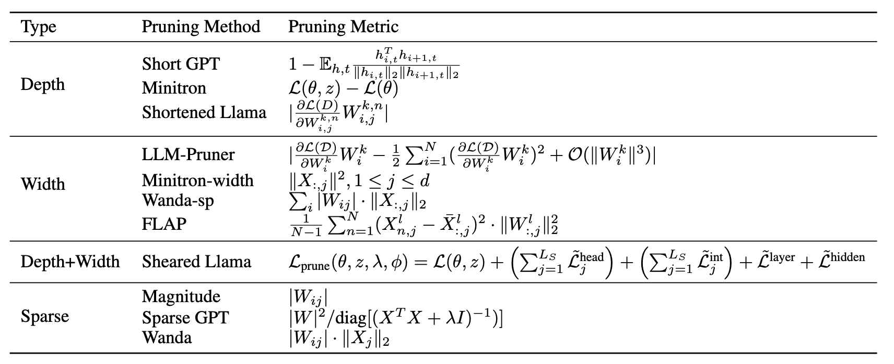

# Pruning

**Pruning Methods Overview**


**Road Map**
- [x] Minitron
- [ ] ShortGPT
- [ ] Wanda
- [ ] SparseGPT
- [ ] Magnitude
- [ ] Sheared Llama
- [ ] LLM Pruner
- [ ] Shortened Llama
- [ ] Wanda-sp
- [ ] FLAP
- [ ] SLEB

## Minitron
Installation:
```bash
bash minitron/scripts/install.sh
```

Prune Llama3.1-8B
```bash
bash minitron/scripts/prune_depth_llama3.1-8b.sh
bash minitron/scripts/prune_width_llama3.1-8b.sh
```

## Short GPT
Installation:
```bash
bash shortgpt/install.sh
```

## Shortened Llama
Installation:
```bash
bash shortened-llm/install.sh
```

## Sheared Llama
Installation:
```bash
bash llmshearing/install.sh
```

## LLM Pruner
Installation:
```bash
bash LLM-Pruner/install.sh
```

## Wanda, Sparse GPT, Magnitude
Installation:
```bash
bash wanda/install.sh
```

Prune Llama-7B, Llama2-7B, Llama3.1-8B
```bash
bash wanda/install.sh
```
