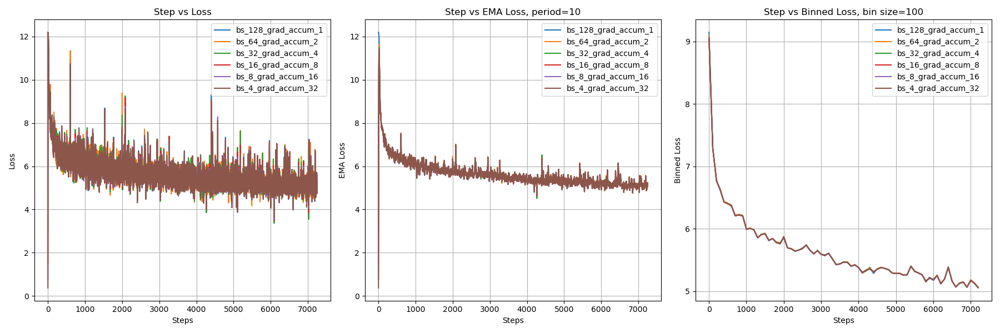

# FMS-FSDP

FMS-FSDP is a scalable model training framework developed by IBM. The repo here modifies it s.t it fits the needs for training pruned models. For the original README, please see [here](ORIGINAL_README.md).

## Install
```bash
bash fms-fsdp/scripts/install.sh
```

## Data Preparation
The models are trained with a subset of DCLM-Baseline-1.0, which can be downloaded from [here](https://huggingface.co/datasets/mlfoundations/dclm-baseline-1.0). The data is pretokenized and stored in pyarrow format, and you may download 60B DCLM data from [here](https://huggingface.co/datasets/Zephyr271828/dclm-260b/tree/llama3-pyarrow-60b).

Customized data preparation: Coming soon!

## Model Conversion
To convert the HuggingFace checkpoint to FMS format, you can run the following script:
```bash
bash scripts/hf2fms.sh \
```

To convert back:
```bash
bash scripts/fms2hf.sh \
```

To verify the 2 formats are equivalent:
```bash
bash scripts/eq_test.sh
```

## Training from scratch
```bash
bash fms-fsdp/scripts/training.sh
```

## Fine-tuning
```bash
bash fms-fsdp/scripts/hf2fms.sh
bash fms-fsdp/scripts/finetuning.sh
```

## Gradient Accumulation
Note that the native fms_fsdp does not support gradient accumulation, and we implemented this feature due to limited computing resources. Please see [fms_fsdp/utils/train_utils.py](fms-fsdp/utils/train_utils.py) for more details.

To verify the correctness of our implementation, we did a toy experiment: we trained a small model, llama3.1-1b, with seq_len=64 with different micro batch size and grad accum steps, while keeping the global batch size=128. The results are as follows:


Due to the small sequence length, the loss curve is somewhat noisy, so we also plotted the Exponential Moving Average (EMA) and the bin average (bin size=100) of the loss. From these curves we can see that the value of gradient accumulation steps has minimal impact on the training loss.

